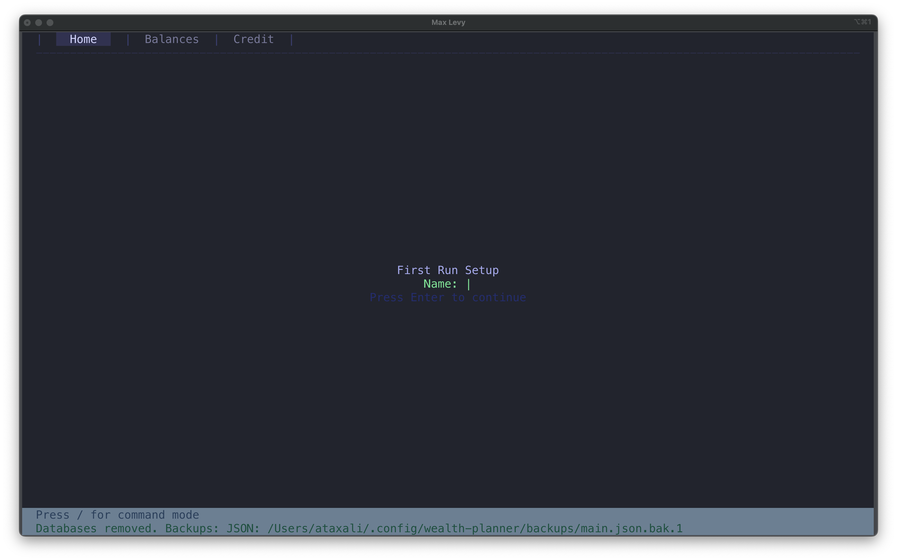
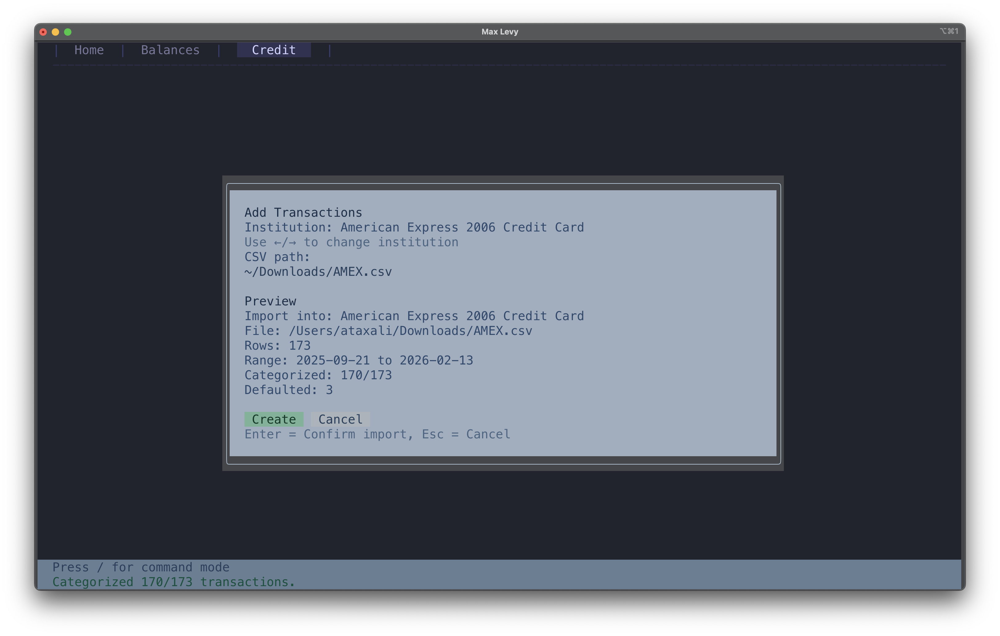
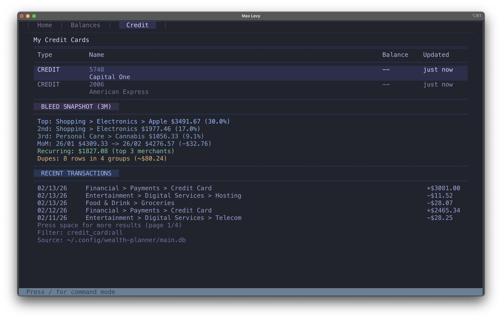
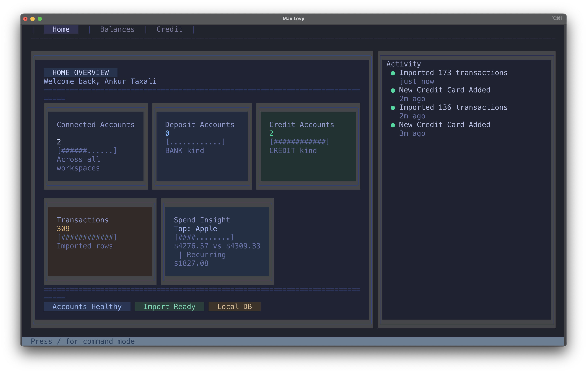

+++
title = "Developer Diary"
date = 2026-02-16T03:16:40Z
draft = false
+++

I almost gave up on this project. I almost threw in the towel.

### First Boot Experience

But then I found the right balance.

### First Time Adding an Account's Transactions

I started to like it.

### Bleed Snapshot Block

The interface is dense but readable. The palette is low-noise and the hierarchy is clear to me.

### Home View with 2 Credit Accounts

I know it's not perfect, but it's good enough for now.